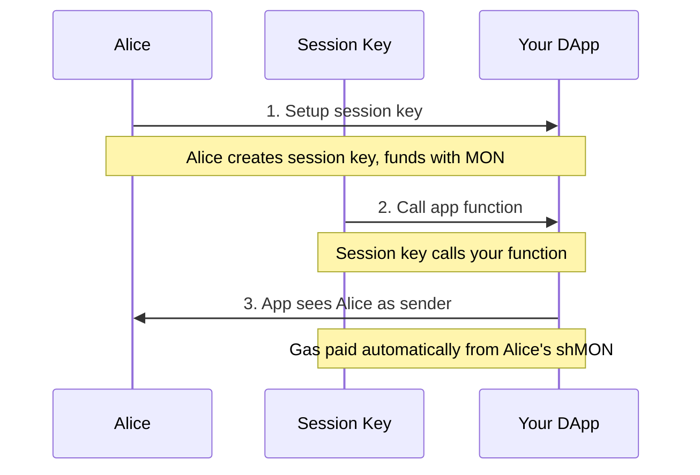
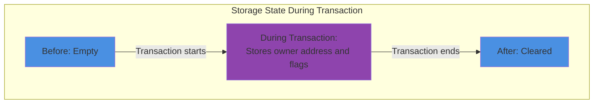

# Gas Relay Module  

> **Seamless gas‑less UX for your dApp, powered by ShMonad & the Task Manager**  

---

## 📚 Overview

The **Gas Relay** module lets you delegate transaction fees to a *session key* that is automatically topped‑up with **MON** (the Monad native token) bonded inside **ShMonad**. End‑users sign with their regular wallet once, then interact through an expendable session key while your dApp silently handles gas.

* **No user gas pop‑ups** – reduce drop‑off and improve onboarding.
* **Policy‑driven security** – every relay is backed by a ShMonad commitment policy that you control.
* **Composable** – integrates with the **Atlas** MEV framework and any EVM‑compatible contract.
* **Battle‑tested** – used in the *Task Manager* contracts that secure Monad's LST liquidity and auctions.

---

## 🗺️ Architecture

### High-Level Flow

```bash
User Wallet ─┐                 ┌─────────────────────────────────┐
             │   1. create     │  GasRelay (this module)      │
             └─▶ Session Key ─▶│   ‑ maintains key metadata       │
                               │   ‑ funds key from ShMonad       │
Session Key ─┐                 │   ‑ exposes GasAbstracted mod.   │
             │ 2. call dApp    └─────────────────────────────────┘
             ▼
        Your dApp               ┌─────────────────────────────────┐
              ▲ 3. execute      │  Task Manager                   │
              └────────────────▶ │   ‑ executes tasks with residual gas │
                                 │   ‑ pays rewards in shMON       │
                                 └─────────────────────────────────┘
```

---

## 🚀 Quick Start

### Prerequisites

* Solidity ^0.8.28
* Hardhat / Foundry for deployment & tests
* Access to a **ShMonad** instance (mainnet or testnet)

### Installation

#### Option 1: Forge (Recommended)

```bash
# Install Foundry if you haven't already
curl -L https://foundry.paradigm.xyz | bash
foundryup

# Add as a dependency to your Forge project
forge install FastLane-Labs/fastlane-contracts

# Default installs from main branch
# For a specific version/branch:
# forge install monad-labs/task-manager-contracts@<branch-or-tag>

# To update dependencies later
forge update
```

#### Option 2: Hardhat/npm

```bash
# Install via npm from GitHub
npm install https://github.com/FastLane-Labs/fastlane-contracts

# Or add to your package.json dependencies
npm install --save https://github.com/FastLane-Labs/fastlane-contracts
```

## 🔌 Integration Guide

To implement gas-less transactions in your dApp:

### 1. Inherit from GasRelay

Your contract must inherit from `GasRelay` to access the gas abstraction functionality:

```solidity
contract MyDApp is GasRelay {
    constructor(
        address taskManager,
        address shMonad,
        uint256 maxExpectedGasUsagePerTx,
        uint48 escrowDuration,
        uint256 targetBalanceMultiplier
    ) 
        GasRelay(taskManager, shMonad, maxExpectedGasUsagePerTx, escrowDuration, targetBalanceMultiplier) 
    {}
    
    // Your contract code...
}
```

### 2. Apply the GasAbstracted modifier

Wrap your public/external functions with the `GasAbstracted` modifier:

```solidity
// Users can call this function via their session key without paying gas
function performAction() external GasAbstracted {
    // Inside this function, msg.sender == session key address
    // But _abstractedMsgSender() == original owner address
    
    address realSender = _abstractedMsgSender();
    
    // Your business logic using the real sender...
}
```

### 3. Gas accounting flow

1. When a session key calls a `GasAbstracted` function, the modifier:
   * Identifies the original owner of the session key
   * Tracks gas consumption during execution
   * Routes surplus gas through the Task Manager
   * Deducts the gas cost from the owner's bonded shMONAD balance
   * Returns any rewards back to the owner

2. Session key balances are managed by:
   * Initial funding during key creation with `updateSessionKey()`
   * Automatic refilling from the owner's bonded shMONAD when needed
   * Manual top-ups with `replenishGasBalance()`

This approach allows EOAs to function as lightweight session keys while the gas costs are covered by the owner's shMONAD bonds, creating a seamless UX for your users.

## 🔄 Transaction Flow Example

Here's a detailed example of how a gas-abstracted transaction works:

```mermaid
flowchart TD
    A[Alice User] --> B[updateSessionKey with 0.1 MON]
    B --> C[Session Key Active]
    C --> D[Session Key calls your function]
    D --> E[Check reentrancy]
    E --> F[Lock and detect session key]
    F --> G[Store Alice as abstracted sender]
    G --> H[Your DApp logic executes]
    H --> I[App calls _abstractedMsgSender]
    I --> J[Returns Alice not session key]
    H --> K[Handle unused gas and execute tasks]
    K --> L[Reimburse gas from shMON]
    L --> M[Clear transient storage]

    style A fill:#2c3e50
    style D fill:#8e44ad
    style H fill:#27ae60
    style I fill:#4a90e2
```



### User Perspective



---

## 🔑 Core Concepts

| Concept                      | Why it matters                                                                                   | Key functions                                                 |
| ---------------------------- | ------------------------------------------------------------------------------------------------ | ------------------------------------------------------------- |
| **Session Key**              | Expendable signer holding enough MON to pay gas. Expires automatically.                          | `updateSessionKey`, `deactivateSessionKey`, `_isSessionKey()` |
| **ShMONAD Policy**           | Bonds user MON into **shMON** shares that can be managed / withdrawn to keep keys funded.        | `_creditToOwnerAndBond`, `_takeFromOwnerBondedShares`         |
| **Gas Abstraction Modifier** | Wrap any public function to make it gas‑less for users.                                          | `GasAbstracted`                                               |
| **Task Execution Rewards**   | Surplus gas is routed through **Task Manager**; shMON rewards are auto‑bonded back to the owner. | `executeTasks`, `_handleUnusedGas`                            |

---

## 🛠️ Contract Surface (public / external)

| Contract       | Signature                                                            | Purpose                                 |
| -------------- | -------------------------------------------------------------------- | --------------------------------------- |
| `GasRelay` | `updateSessionKey(address key, uint256 expiry)`                      | Create / modify session key             |
|                | `replenishGasBalance()`                                              | Top‑up key, bond surplus                |
|                | `deactivateSessionKey(address key)`                                  | Early key removal                       |
|                | `getCurrentSessionKeyData(address owner)`                            | View helper (balances, expiry, targets) |
|                | **Modifiers**: `GasAbstracted`, `CreateOrUpdateSessionKey`, `Locked` | Plug‑in to your functions               |


---

## 🔐 Security Notes

1. **Session Key Limits** – Keys can *only* spend gas; they cannot withdraw bonded funds.
2. **Reentrancy Guards** – `Locked` modifier hardens every external entry point.
3. **Expiration Enforcement** – All logic checks `block.number` < `expiration` before funding or abstraction.
4. **Fail‑Safe Refunds** – If MON transfer to the key fails, the tx reverts with `SessionKeyMonTransferFailed`.
5. **EIP-7702 Protection** – The system is designed to be secure against reentrancy from 7702-enabled EOAs with a pessimistic security model.

### Transient Storage Security Model

The GasRelay system uses transient storage to track per-transaction state securely:



---

## 🧪 Testing

* Foundry test‑suite: `forge test --match-contract GasRelay*`

## 📝 License

BUSL‑1.1 © Fastlane Labs 2025 