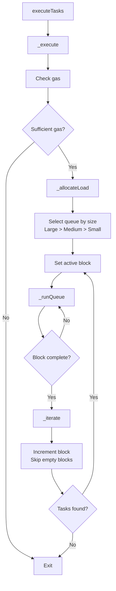
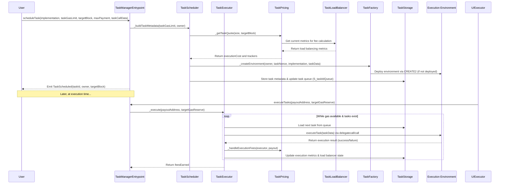
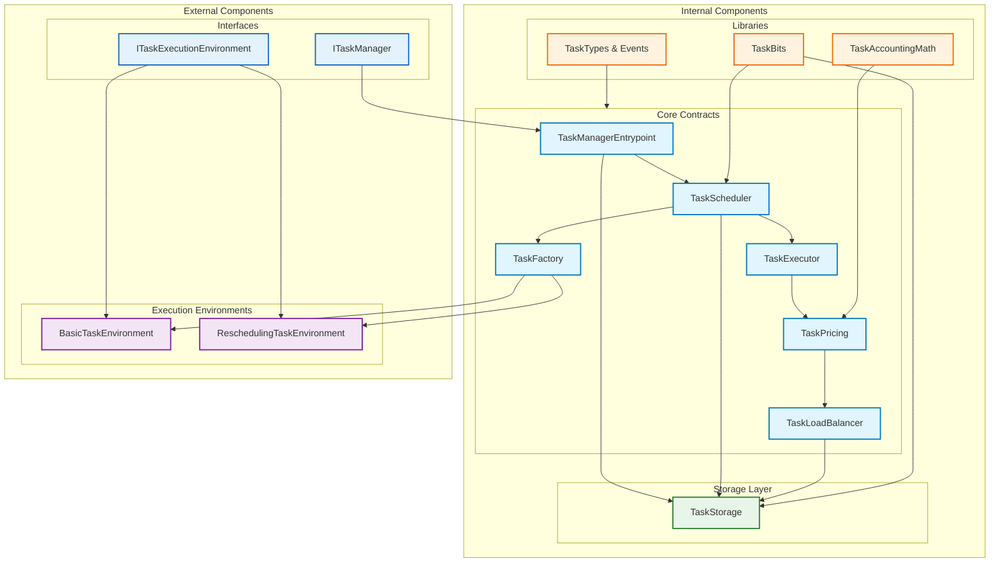

# Task Manager

Task scheduling and execution system for Monad blockchain using shMONAD for economic security.

## Overview

The Task Manager enables scheduling and execution of smart contract tasks with:
- Gas-based task categorization
- Block-based scheduling
- Economic security via shMONAD bonding

## Architecture

Core system components:

1. **TaskManagerEntrypoint**
   - Public interface
   - Access control and validation
   - Task scheduling and execution
   - Reentrancy protection

2. **TaskScheduler**
   - Task scheduling
   - Task quoting
   - Block-based scheduling
   - Task cancellation

3. **TaskExecutor**
   - Task execution
   - Environment management
   - Fee distribution
   - Execution safety

4. **LoadBalancer**
   - Load distribution
   - Block-based metrics
   - Task allocation
   - Performance tracking

5. **TaskPricing**
   - Fee calculation
   - Period-based averaging
   - Congestion adjustment
   - Base fee management

6. **TaskFactory**
   - Environment creation
   - CREATE2 deployment
   - Parameter embedding
   - Address generation

7. **TaskStorage**
   - State management
   - Metadata tracking
   - Load balancer state
   - Task queues

## Execution Environments

1. **BasicTaskEnvironment**
   - Provides isolated execution context
   - Validates pre-execution conditions
   - Logs execution events
   - Uses simple call pattern

2. **ReschedulingTaskEnvironment**
   - Extends basic environment
   - Adds automatic retry logic
   - Handles task rescheduling
   - Tracks execution attempts

## Core Interface

```solidity
interface ITaskManager {
    // Scheduling Tasks with Native MON
    function scheduleTask(
        address implementation,
        uint256 taskGasLimit,
        uint64 targetBlock,
        uint256 maxPayment,
        bytes calldata taskCallData
    )
        external
        payable
        returns (bool scheduled, uint256 executionCost, bytes32 taskId);
    
    // Scheduling Tasks with Bonded shMONAD
    function scheduleWithBond(
        address implementation,
        uint256 taskGasLimit,
        uint64 targetBlock,
        uint256 maxPayment,
        bytes calldata taskCallData
    )
        external
        returns (bool scheduled, uint256 executionCost, bytes32 taskId);
    
    // Rescheduling an Active Task
    function rescheduleTask(
        uint64 targetBlock,
        uint256 maxPayment
    )
        external
        payable
        returns (bool rescheduled, uint256 executionCost, bytes32 taskId);
    
    // Cancelling a Task
    function cancelTask(bytes32 taskId) external;
    
    // Executing Tasks
    function executeTasks(address payoutAddress, uint256 targetGasReserve) 
        external returns (uint256 feesEarned);
    
    // Task Information
    function getAccountNonce(address account) external view returns (uint64);
    function estimateRequiredBond(
        address implementation,
        uint256 taskGasLimit,
        uint64 targetBlock,
        bytes calldata taskCallData
    ) external view returns (uint256);
    function getTaskMetadata(bytes32 taskId) external view returns (TaskMetadata memory);
    function getNextExecutionBlockInRange(uint64 startBlock, uint64 endBlock) external view returns (uint64);
}
```

## Task Structure

Tasks are represented by a packed bytes32 identifier that contains:
- Execution Environment Address: The deployed environment for the task
- Scheduled Block Number & Index: To track the task's place in the queue
- Task Size: Indicates gas requirements (Small, Medium, Large)
- Cancellation Status: A flag to mark if the task has been cancelled

```solidity
enum Size {
    Small,   // <= 100,000 gas
    Medium,  // <= 250,000 gas
    Large    // <= 750,000 gas
}

struct TaskMetadata {
    address owner;    // Task owner
    uint64 nonce;     // Task nonce
    bool isActive;    // Active status
}
```

## Economic Security

The system supports two payment mechanisms for task execution:

1. **One-time Tasks with MON:**
   - Users can pay directly with native MON tokens
   - Payment is sent along with the `scheduleTask` function call
   - Suitable for simple, non-recurring tasks
   - No bonding/staking required

2. **Repeatable Tasks with shMONAD:**
   - Uses bonded shMONAD (staked MONAD) for economic security
   - Required for tasks that may need to be rescheduled or are part of a recurring system
   - Bond amounts are calculated dynamically based on:
     - Historical execution costs
     - Task size category
     - Block distance
     - Network congestion

For both payment methods, fees are distributed between:
- Protocol: 25%
- Validator (block.coinbase): 26%
- Executor: 49%

## Load Balancing

The system implements a sophisticated load balancing mechanism:
- Multi-depth tracking system (B, C, D trackers)
- Dynamic fee adjustment based on historical data
- Block-based task distribution
- Bitmap-based block skipping
- Congestion-aware scheduling

## Load Balancer Workflow

The TaskLoadBalancer module manages task execution across different sizes and blocks:

### 1. Queue Selection at Execution Start
- **Execution Entry Point**
  - `executeTasks` call is delegated to `_execute` in TaskExecutor
  - Initial gas calculations and safety checks performed

- **Allocating Load**
  - `_allocateLoad` determines queue based on available gas
  - Reserves gas for post-execution operations
  - Checks queues in order: Large → Medium → Small
  - Selects earliest active block with pending tasks

### 2. Running the Selected Queue
- **Task Loading**
  - `_loadNextTask` fetches next task from current block
  - Validates task metadata and execution requirements

- **Task Execution**
  - Invokes task environment with size-specific gas limit
  - Handles execution results and state updates

- **Fee Handling**
  - `_getReimbursementAmount` computes fees
  - Updates execution metrics and distributes payments

### 3. Block Iteration
- **Block Advancement**
  - `_iterate` triggers when current block is complete
  - Uses bitmap flags for efficient block skipping
  - Leverages `_GROUP_SIZE` and `_BITMAP_SPECIFICITY` for optimization

- **State Management**
  - Updates metrics via `_storeSpecificTracker`
  - Maintains load balancer pointers
  - Ensures consistent state across executions

### 4. System Integration
- **Pricing Integration**
  - Provides metrics for dynamic fee calculation
  - Supports multi-depth tracking for fee adjustments

- **State Persistence**
  - Maintains execution metrics at block, group, and supergroup levels
  - Ensures consistent load balancer state across iterations

### Execution Flow



## Task Flow



## Component Architecture



## Execution Environment

Tasks are executed in isolated environments:
- Deterministic addressing using CREATE2
- One environment per task
- No persistent state
- Strict gas limits per size category
- Comprehensive reentrancy protection

## Events

```solidity
event TaskScheduled(bytes32 indexed taskId, address indexed owner, uint64 targetBlock);
event ExecutionEnvironmentCreated(address indexed owner, address environment, address implementation, uint64 taskNonce);
event ExecutorReimbursed(address indexed executor, uint256 amount);
event ProtocolFeeCollected(uint256 amount);
```

## Usage Example

```solidity
// Schedule a task using native MON
(bool scheduled, uint256 executionCost, bytes32 taskId) = taskManager.scheduleTask(
    targetContract,      // Implementation address (target of delegatecall)
    100_000,             // Task gas limit (must be ≤ LARGE_GAS)
    block.number + 10,   // Target block for execution (must be in the future)
    maxPayment,          // Maximum payment willing to pay
    encodedCalldata      // Encoded function call data
);

// Schedule a task with bonded shMONAD
(bool scheduled, uint256 executionCost, bytes32 taskId) = taskManager.scheduleWithBond(
    targetContract,      // Implementation address
    100_000,             // Task gas limit
    block.number + 10,   // Target block
    maxPayment,          // Maximum payment
    encodedCalldata      // Call data
);

// To reschedule an active task (from within the execution environment)
(bool rescheduled, uint256 executionCost, bytes32 newTaskId) = taskManager.rescheduleTask(
    block.number + 5,    // New target block
    maxPayment           // Updated max payment if needed
);
```

## Integration Guide

For detailed instructions on integrating with the Task Manager system, including:
- Task encoding patterns
- Execution environment usage
- Authorization models
- Security best practices
- Custom environment creation

See the [Task Manager Integration Guide](./integration.md).

## Security Model

1. **Execution Isolation**
   - Isolated environments per task
   - No cross-task interference
   - Clean execution context

2. **Access Control**
   - Owner-based task management
   - Executor-only task execution
   - Protocol-controlled fee distribution

3. **Economic Security**
   - shMONAD-based bonding
   - Dynamic fee calculation
   - Fair distribution model

4. **Safety Measures**
   - Comprehensive reentrancy protection
   - Strict gas limits
   - Safe transfer patterns
   - Immutable critical addresses

## Libraries and Utilities

1. **TaskBits**
   - Efficient task metadata packing
   - Unpacking utilities
   - Storage optimization

2. **TaskAccountingMath**
   - Fee calculation helpers
   - Protocol fee constants (25% protocol, 26% validator, 49% executor)
   - Weighted average computation

3. **Types and Errors**
   - Shared data structures
   - Custom error definitions
   - Event declarations 